# Лабораторная работа #1

1. Цель работы. 
Проектирование и реализация web-приложения для поиска авиабилетов.

2. Функциональные требования. 
Регистрация и авторизация пользователей. 
Изменение личных данных зарегистрированных пользователей. 
Поиск рейсов по дате вылета, пункту вылета и пункту прибытия. 
Поиск билетов на выбранный рейс. 
Добавление билетов в заказ и их приобретение. 
Добавление и удаление дополнительных услуг к билету. 
Удаление билета из заказа и возврат оплаченного билета. 
Просмотр характеристик обслуживающего данный рейс самолета.

3. Use-case диаграммы.

4. BPMN диаграммы.

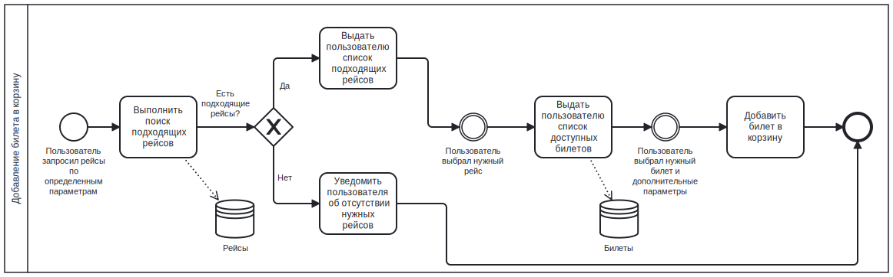

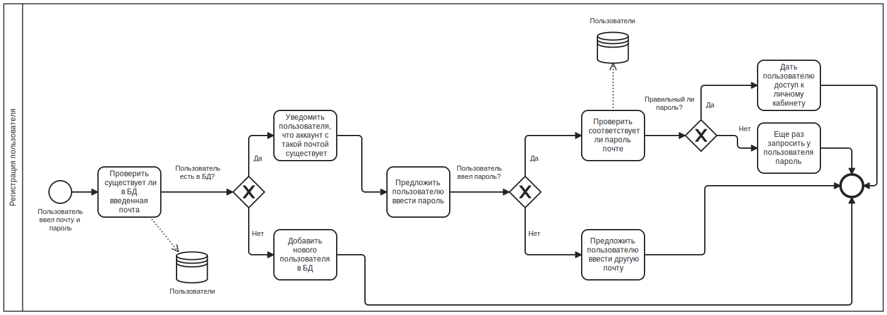

5. Пользовательские сценарии.

    5.1. Пользователь N хочет добраться из пункта A в пункт B на самолете, поэтому заходит на сайт, регистрируется и с помощью параметров находит подходящие рейсы. 
    Далее на выбранный рейс пользователь находит билеты и добавляет их в заказ. 
    Пользователь оплачивает заказ.

    5.2. Пользователь N захотел вернуть купленный билет. 
    Для этого он заходит в раздел "История заказов", смотрит детали заказа и имеет право вернуть билет, если до вылета самолета осталось более 2-х часов.

    5.3. Пользователь N решил обновить личные данные. 
    Для этого он авторизуется, заходит в раздел "Настройки" и меняет почту, пароль, имя или фамилию.

6. Диаграмма "Сущность-связь"

7. Диаграмма базы данных

8. Компонентная диаграмма системы

9. Экраны будущего web-приложения

[Ссылка на Figma](https://www.figma.com/file/Uci2ji80aSMaSgmuuCWede/web?type=design&mode=design&t=7bhYOV5ikl5BGoHo-1)

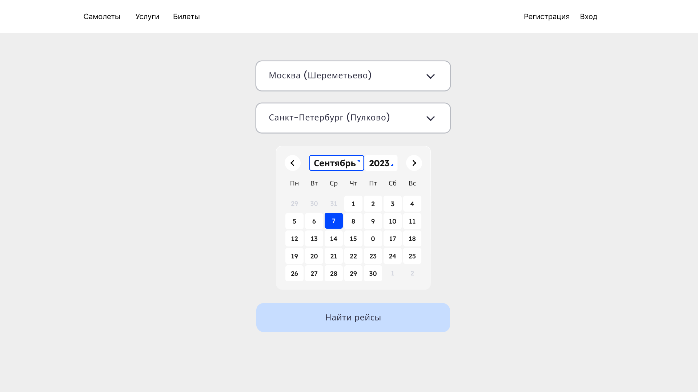

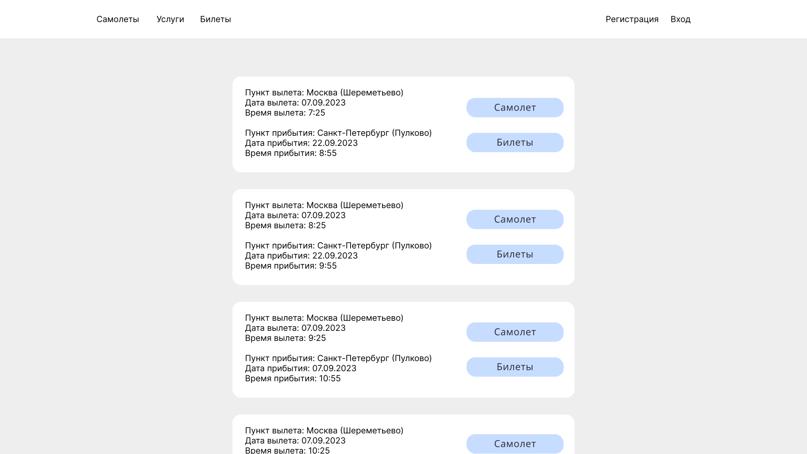

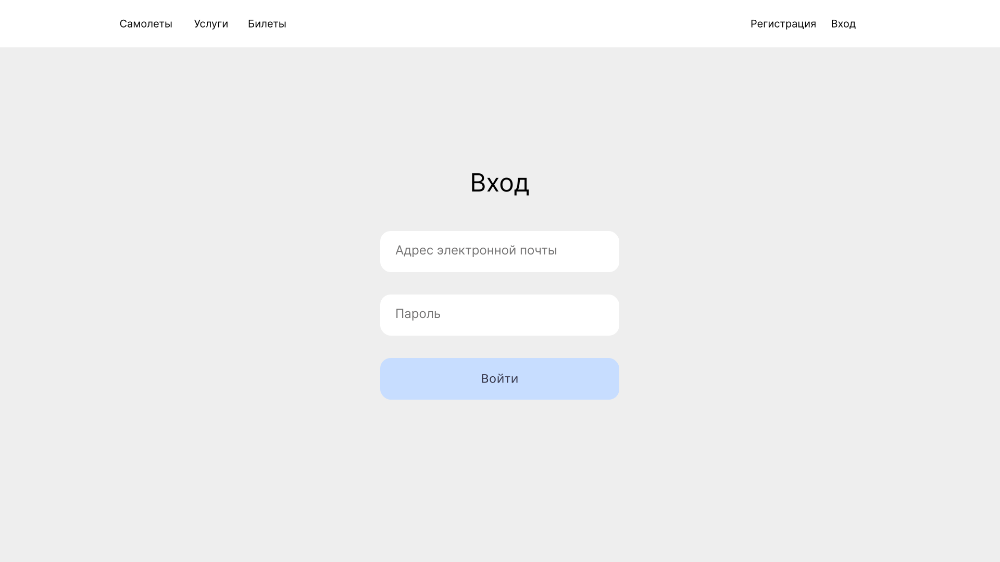

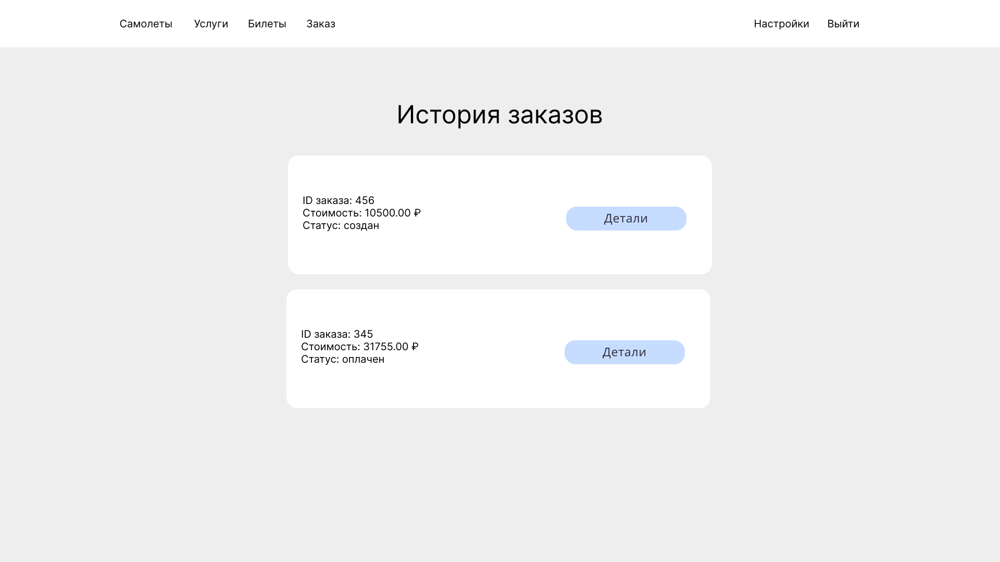

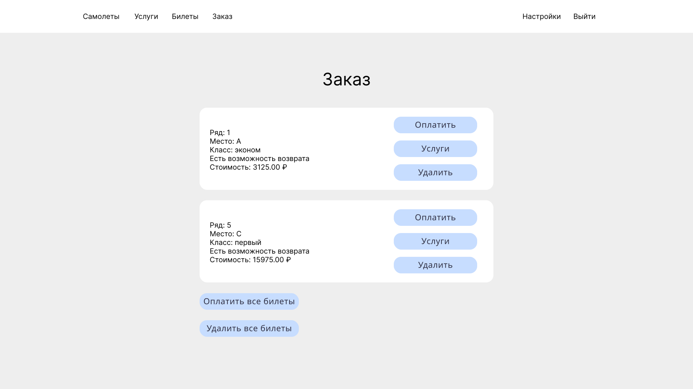

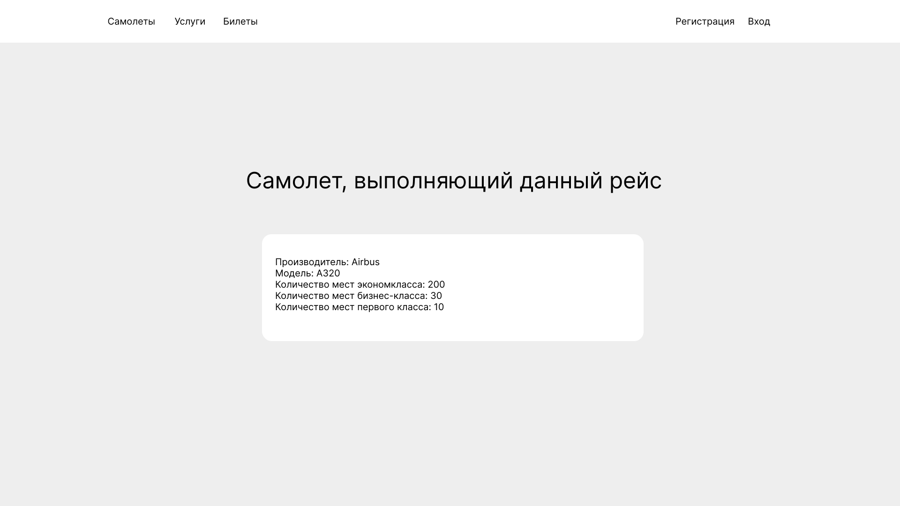

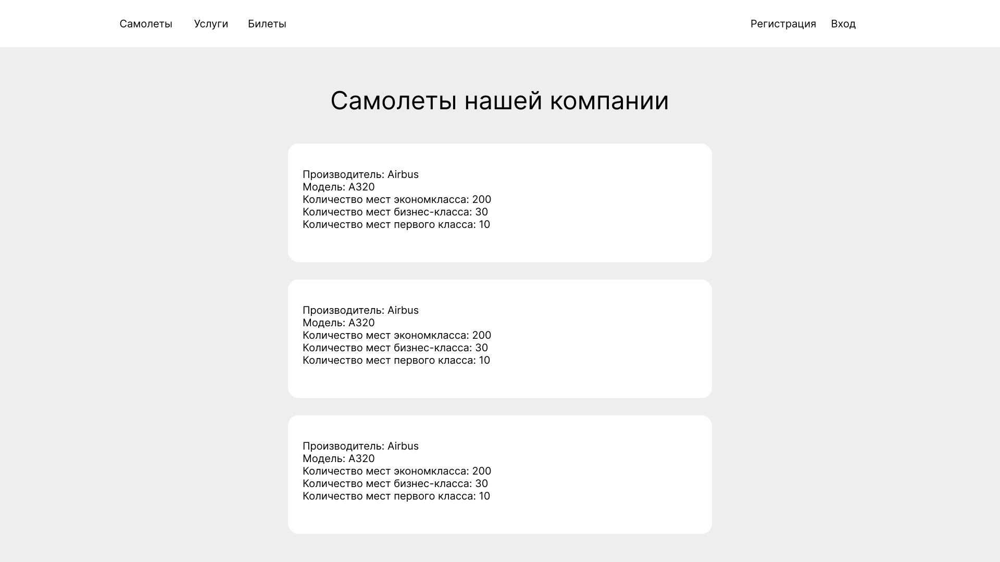

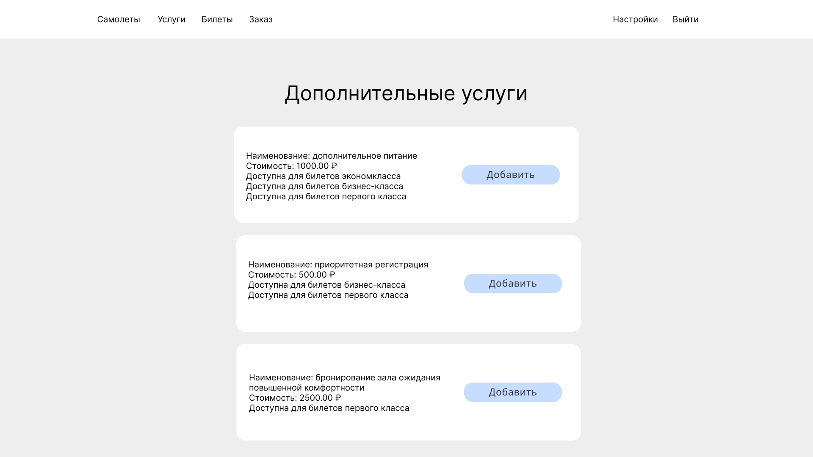

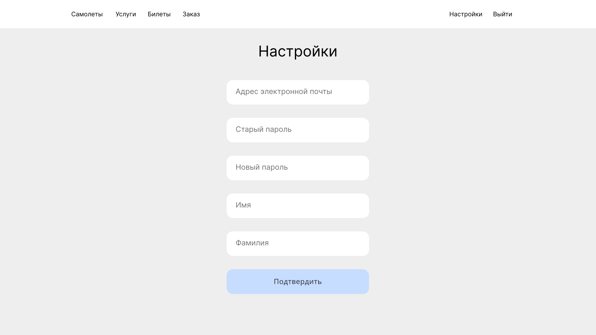

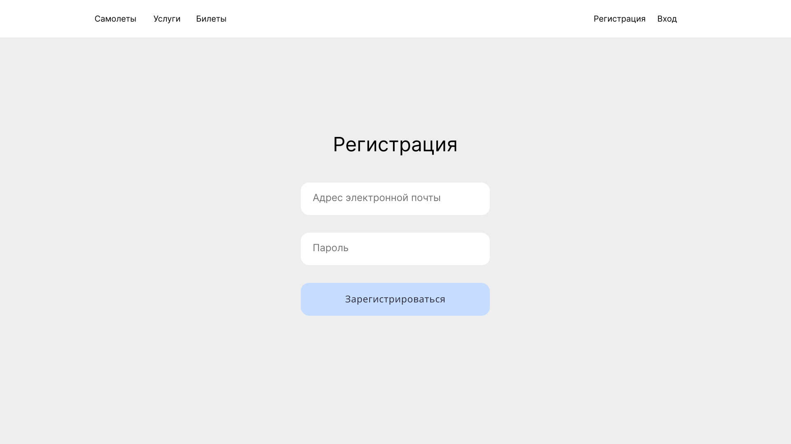

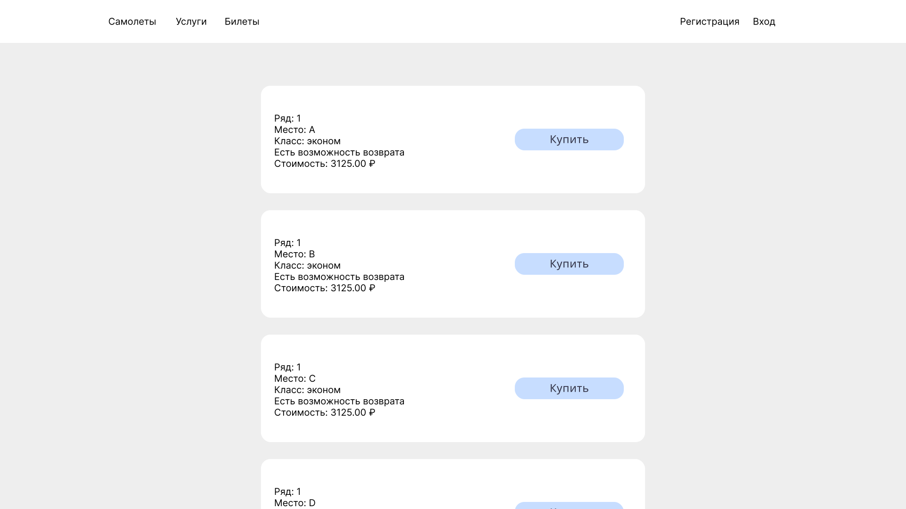
